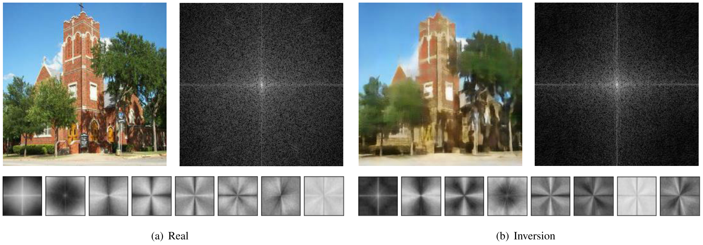
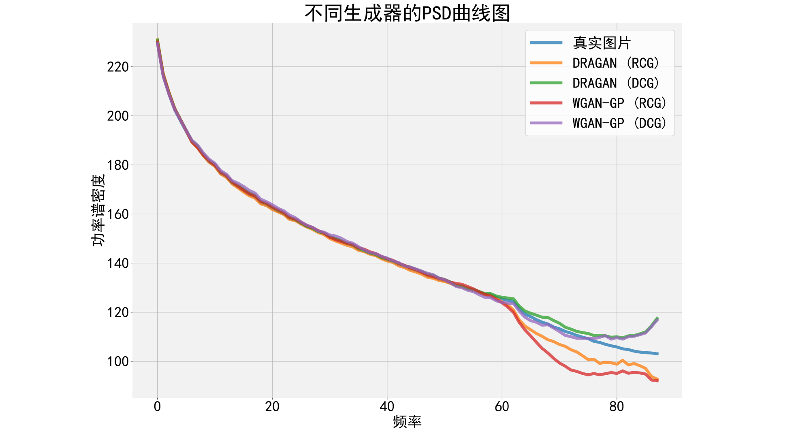
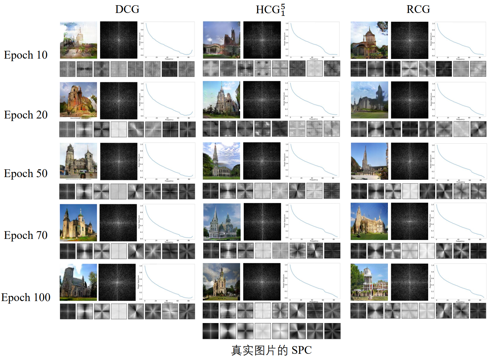
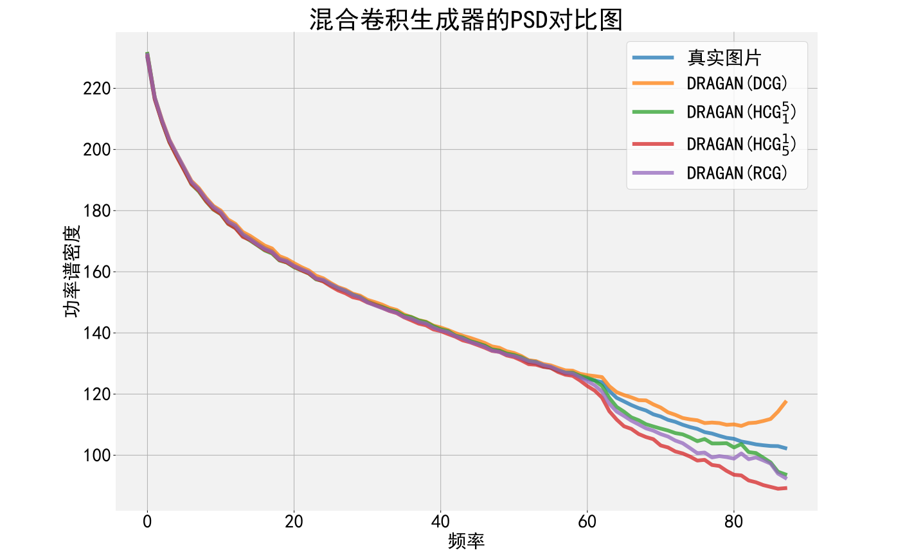
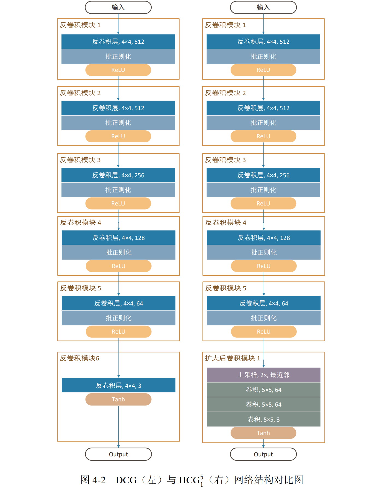

论文标题
The frequency discrepancy between real and generated image 

论文地址
https://ieeexplore.ieee.org/document/9500220/

本文则从频率的角度对生成式对抗网络、变分自编码器等生成模型进行系统的分析，研究生成模型所生成的图片与真实数据集的图片之间的频率差异。主要贡献概括如下：

 (1) 本工作首先提出了可以在频率域上量化差异的一维功率谱密度曲线、频率主成分等工具，这些工具解决了目前频率上的差异用肉眼难以区分、 难以量化的问题。同时，我们运用这些工具证明了对具有各种频率分布的模型和数据集进行了实验，进而发现这些差异主要表现为低频部分学习较好、高频部分出现明显差异。本文还对非常规的数据集进行了研究，证明了生成模型的频率偏好。本文提出的频率差异是跨数据集、跨模型的，即具有普遍存在性。

 (2) 本工作进一步从信号重建的角度，以数学公式的推导证明了频率差异的来源。本文提出，频域上的差异来自于生成模型中的上采样模块，不同的上采样模块会在高频部分产生不同的差异。常用的两种上采样方式各有优劣，在训练不同数据集时应当选用合适的上采样生成器。本文还进行了几个扩展实验，结果表明不同的批大小、训练时长对频域的影响较小，不同的生成器对频域影响较大。

 (3) 结合这些研究，本工作提供了一些新颖的解决方案来减小频域上的差异，即应用混合卷积生成器。混合卷积生成器能够很好地结合两种上采样的特点，同时保证生成图片在视觉上和在频域上与真实图片相近。本文还在前沿的生成式对抗网络模型中证明了这种解决方案的有效性。最后，本工作展示了变分自编码器上同样存在的频率差异，并将混合卷积的解决方案应用到变分自编码器中，进一步展示了其有效性。

